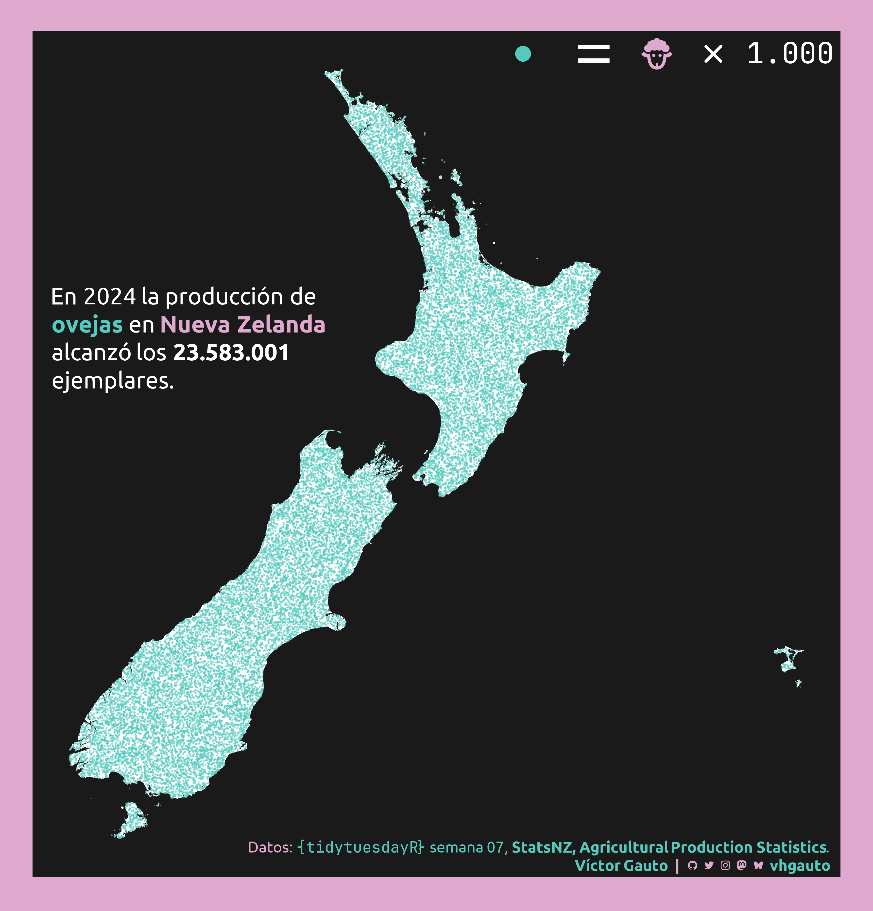

---
format:
  html:
    code-fold: show
    code-summary: "Ocultar código"
    code-line-numbers: false
    code-annotations: false
    code-link: true
    code-tools:
        source: true
        toggle: true
        caption: "Código"
    code-overflow: scroll
    page-layout: full
editor_options:
  chunk_output_type: console
categories:
  - geom_spatvector
execute:
  eval: false
  echo: true
  warning: false
title: "Semana 07"
date: last-modified
author: Víctor Gauto
---

Cantidad máxima de ovejas en Nueva Zelanda.

::: {.column-page-right}



:::

## Paquetes

```{r}
library(glue)
library(ggtext)
library(showtext)
library(tidyverse)
```

## Estilos

Colores.

```{r}
c1 <- "#54cabe"
c2 <- "#dea9cc"
c3 <- "white"
c4 <- "grey10"
```

Fuentes: Ubuntu y JetBrains Mono.

```{r}
font_add(
  family = "ubuntu",
  regular = "././fuente/Ubuntu-Regular.ttf",
  bold = "././fuente/Ubuntu-Bold.ttf",
  italic = "././fuente/Ubuntu-Italic.ttf"
)

font_add(
  family = "jet",
  regular = "././fuente/JetBrainsMonoNLNerdFontMono-Regular.ttf"
)

showtext_auto()
showtext_opts(dpi = 300)
```

## Epígrafe

```{r}
fuente <- glue(
  "Datos: <span style='color:{c1};'><span style='font-family:jet;'>",
  "</span> semana 07, ",
  "<b>StatsNZ, Agricultural Production Statistics</b>.</span>"
)

autor <- glue("<span style='color:{c1};'>**Víctor Gauto**</span>")
icon_twitter <- glue("<span style='font-family:jet;'>&#xf099;</span>")
icon_instagram <- glue("<span style='font-family:jet;'>&#xf16d;</span>")
icon_github <- glue("<span style='font-family:jet;'>&#xf09b;</span>")
icon_mastodon <- glue("<span style='font-family:jet;'>&#xf0ad1;</span>")
icon_bsky <- glue("<span style='font-family:jet;'>&#xe28e;</span>")
usuario <- glue("<span style='color:{c1};'>**vhgauto**</span>")
sep <- glue("**|**")

mi_caption <- glue(
  "{fuente}<br>{autor} {sep} {icon_github} {icon_twitter} {icon_instagram} ",
  "{icon_mastodon} {icon_bsky} {usuario}"
)
```

## Datos

```{r}
tuesdata <- tidytuesdayR::tt_load(2026, 07)
dataset <- tuesdata$dataset
```

## Procesamiento

Me interesa crear un mapa con puntos por cada oveja durante su máxima cantidad sobre Nueva Zelanda.

Mapa de Nueva Zelanda para ubicar los puntos.

```{r}
nz <- rgeoboundaries::geoboundaries(country = "New Zealand", adm_lvl = 0) |>
  sf::st_geometry() |>
  sf::st_transform(27200)
```

Conservo los datos para el total de ovejas, la máxima cantidad disponible y aplico un factor de escala para luego incorporar los puntos.

```{r}
escala <- 1e3

d <- dataset |>
  filter(measure == "Total Sheep") |>
  slice_max(order_by = year_ended_june, n = 1, by = measure) |>
  mutate(r = round(value / escala))
```

A partir del vector de Nueva Zelanda ubico la cantidad de puntos, afectado por la escala, de manera aleatoria.

```{r}
set.seed(2026)
p <- sf::st_sample(nz, d$r) |>
  terra::vect()
```

## Figura

Título, leyenda indicando el factor de escala y formato a los números.

```{r}
mi_titulo <- glue(
  "En 2024 la producción de<br><b style='color:{c1}'>ovejas</b> en 
  <b style='color: {c2};'>Nueva Zelanda</b><br>alcanzó los 
  **{cantidad_label}**<br>ejemplares."
)

mi_leyenda <- glue(
  "<span style='color: {c1};'>&#xf444;</span> &#xf01fc; 
  <span style='color: {c2};'>&#xf0cc6;</span> &#xf467;"
)

cantidad_label <- format(d$cantidad, big.mark = ".", decimal.mark = ",")

escala_label <- format(escala, big.mark = ".", decimal.mark = ",")
```

Figura.

```{r}
g <- ggplot() +
  tidyterra::geom_spatvector(data = nz, fill = c3, color = NA) +
  tidyterra::geom_spatvector(data = p, size = .3, alpha = .5, color = c1) +
  annotate(
    geom = "richtext",
    # x = I(.4),
    # y = I(.2),
    x = I(.02),
    y = I(.7),
    label = mi_titulo,
    hjust = 0,
    vjust = 1,
    size = 8,
    family = "ubuntu",
    fill = NA,
    color = c3,
    label.color = NA
  ) +
  annotate(
    geom = "richtext",
    x = I(c(.875, 1)),
    y = I(c(1, .991)),
    label = c(mi_leyenda, escala_label),
    hjust = 1,
    vjust = 1,
    size = c(18, 10),
    family = "jet",
    fill = NA,
    color = c3,
    label.color = NA
  ) +
  labs(caption = mi_caption) +
  ggthemes::theme_few(base_family = "ubuntu") +
  theme_sub_plot(
    background = element_rect(fill = c2, color = NA),
    margin = margin_auto(30),
    caption = element_markdown(
      color = c2,
      margin = margin(t = -35, r = 10),
      size = 15,
      lineheight = 1.2
    )
  ) +
  theme_sub_panel(
    background = element_rect(fill = c4, color = NA),
    border = element_blank()
  ) +
  theme_sub_axis(text = element_blank(), ticks = element_blank())
```

Guardo.

```{r}
ggsave(
  plot = g,
  filename = "tidytuesday/2026/semana_07.png",
  width = 30,
  height = 31.3,
  units = "cm"
)
```
