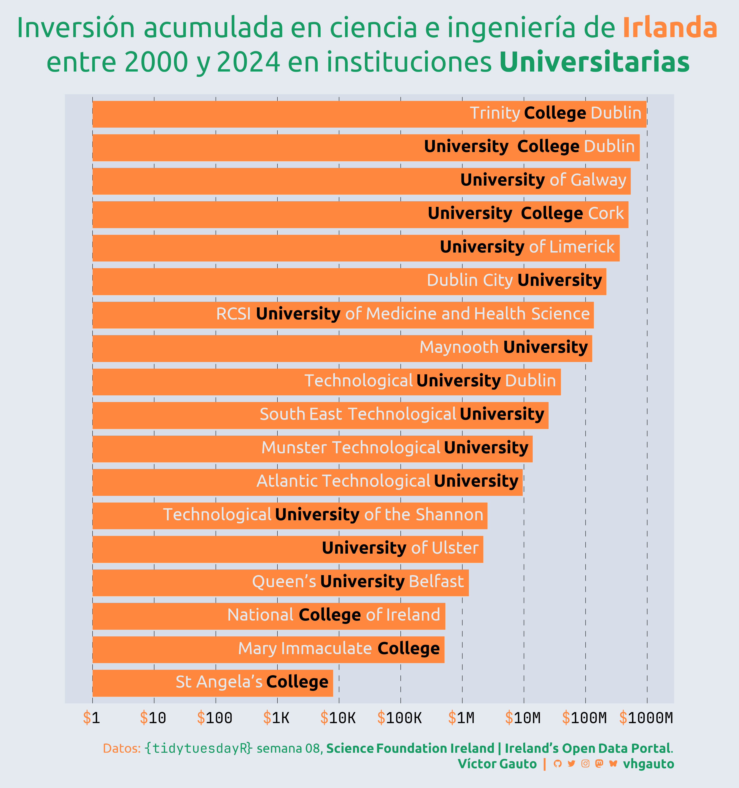

---
format:
  html:
    code-fold: show
    code-summary: "Ocultar código"
    code-line-numbers: false
    code-annotations: false
    code-link: true
    code-tools:
        source: true
        toggle: true
        caption: "Código"
    code-overflow: scroll
    page-layout: full
editor_options:
  chunk_output_type: console
categories:
  - geom_col
  - geom_richtext
execute:
  eval: false
  echo: true
  warning: false
title: "Semana 08"
date: last-modified
author: Víctor Gauto
---

Inversión acumulada en ciencia e ingeniería en Irlanda.

::: {.column-page-right}



:::

## Paquetes

```{r}
library(glue)
library(ggtext)
library(showtext)
library(tidyverse)
```

## Estilos

Colores.

```{r}
c1 <- "#e5e9f0"
c2 <- "#ff883e"
c3 <- "#169b62"
c4 <- "black"
c5 <- "#d8dee9"
```

Fuentes: Ubuntu y JetBrains Mono.

```{r}
font_add(
  family = "ubuntu",
  regular = "././fuente/Ubuntu-Regular.ttf",
  bold = "././fuente/Ubuntu-Bold.ttf",
  italic = "././fuente/Ubuntu-Italic.ttf"
)

font_add(
  family = "jet",
  regular = "././fuente/JetBrainsMonoNLNerdFontMono-Regular.ttf"
)

showtext_auto()
showtext_opts(dpi = 300)
```

## Epígrafe

```{r}
fuente <- glue(
  "Datos: <span style='color:{c3};'><span style='font-family:jet;'>",
  "</span> semana 08, ",
  "<b>Science Foundation Ireland | Ireland's Open Data Portal</b>.</span>"
)

autor <- glue("<span style='color:{c3};'>**Víctor Gauto**</span>")
icon_twitter <- glue("<span style='font-family:jet;'>&#xf099;</span>")
icon_instagram <- glue("<span style='font-family:jet;'>&#xf16d;</span>")
icon_github <- glue("<span style='font-family:jet;'>&#xf09b;</span>")
icon_mastodon <- glue("<span style='font-family:jet;'>&#xf0ad1;</span>")
icon_bsky <- glue("<span style='font-family:jet;'>&#xe28e;</span>")
usuario <- glue("<span style='color:{c3};'>**vhgauto**</span>")
sep <- glue("**|**")

mi_caption <- glue(
  "{fuente}<br>{autor} {sep} {icon_github} {icon_twitter} {icon_instagram} ",
  "{icon_mastodon} {icon_bsky} {usuario}"
)
```

## Datos

```{r}
tuesdata <- tidytuesdayR::tt_load(2026, 08)
sfi_grants <- tuesdata$sfi_grants
```

## Procesamiento

Me interesa la cantidad de dinero invertido en universidades.

Filtro los datos por *Universitiy* y *College* y sumo el total por cada institución, agrego estilos de texto y creo factores ordenados.

```{r}
d <- sfi_grants |>
  filter(str_detect(research_body, "University|College")) |>
  reframe(s = sum(current_total_commitment), .by = research_body) |>
  mutate(research_body = str_remove(research_body, " \\(.*\\)")) |>
  mutate(
    research_body = str_replace(
      research_body,
      "College",
      glue("<b style='color: {c4};'>College</b>")
    )
  ) |>
  mutate(
    research_body = str_replace(
      research_body,
      "University",
      glue("<b style='color: {c4};'>University</b>")
    )
  ) |>
  mutate(research_body = fct_reorder(research_body, s))
```

## Figura

Título y figura.

```{r}
mi_titulo <- glue(
  "Inversión acumulada en ciencia e ingeniería de <b style='color:
  {c2};'>Irlanda</b><br>entre 2000 y 2024 en instituciones <b>Universitarias</b>"
)

g <- ggplot(d, aes(s, research_body, label = research_body)) +
  geom_col(fill = c2, color = NA, linewidth = 1, width = .8) +
  geom_richtext(
    hjust = 1,
    fill = NA,
    label.size = unit(0, "pt"),
    size = 7,
    family = "ubuntu",
    color = c1
  ) +
  scale_x_log10(
    breaks = 10^(0:9),
    labels = scales::label_currency(
      scale_cut = scales::cut_long_scale(),
      prefix = glue("<b style='color: {c2};'>$</b>"),
      big.mark = "",
      decimal.mark = ","
    )
  ) +
  coord_cartesian(clip = "off") +
  labs(x = NULL, y = NULL, title = mi_titulo, caption = mi_caption) +
  ggthemes::theme_few(base_size = 22, base_family = "ubuntu") +
  theme(aspect.ratio = 1) +
  theme_sub_plot(
    margin = margin_auto(20),
    background = element_rect(fill = c1, color = NA),
    title = element_markdown(
      color = c3,
      hjust = .5,
      size = 33,
      margin = margin(b = 20),
      lineheight = 1.2
    ),
    caption = element_markdown(
      color = c2,
      margin = margin(t = 20),
      size = 15,
      lineheight = 1.2
    )
  ) +
  theme_sub_panel(
    background = element_rect(fill = c5, color = NA),
    border = element_blank(),
    grid.major.x = element_line(linewidth = .2, linetype = "FF", color = c4)
  ) +
  theme_sub_axis_left(text = element_blank(), ticks = element_blank()) +
  theme_sub_axis_bottom(
    text = element_markdown(
      family = "jet",
      color = c4,
      margin = margin(t = 10)
    ),
    ticks = element_blank()
  )
```

Guardo.

```{r}
ggsave(
  plot = g,
  filename = "tidytuesday/2026/semana_08.png",
  width = 30,
  height = 32,
  units = "cm"
)
```
