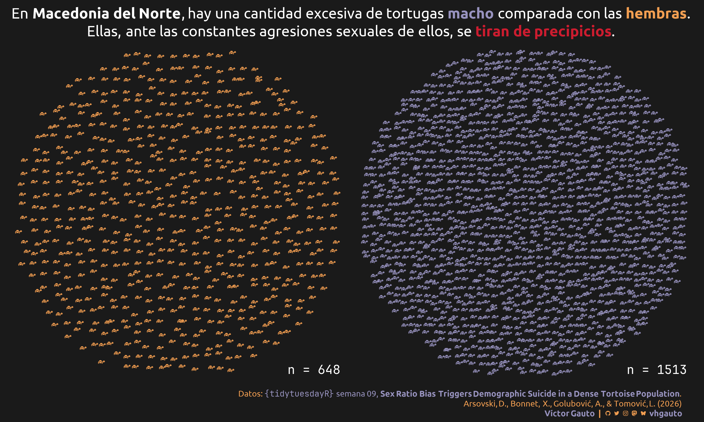

---
format:
  html:
    code-fold: show
    code-summary: "Ocultar código"
    code-line-numbers: false
    code-annotations: false
    code-link: true
    code-tools:
        source: true
        toggle: true
        caption: "Código"
    code-overflow: scroll
    page-layout: full
editor_options:
  chunk_output_type: console
categories:
  - GEOM_AAA
  - GEOM_BBB
  - GEOM_CCC
execute:
  eval: false
  echo: true
  warning: false
title: "Semana 09"
date: last-modified
author: Víctor Gauto
---

XXXXXXXXXXXXXXXXXXXXXXXXXXXXXXXXXXXX
XXXXX DESCRIPCIÓN DE LA FIGURA XXXXX
XXXXXXXXXXXXXXXXXXXXXXXXXXXXXXXXXXXX

::: {.column-page-right}



:::

## Paquetes

```{r}
library(glue)
library(ggtext)
library(showtext)
library(tidyverse)
```

## Estilos

Colores.

```{r}
c1 <- "#9792be"
c2 <- "#f29e51"
c3 <- "#cc1c2f"
c4 <- "white"
c5 <- "grey10"
```

Fuentes: Ubuntu y JetBrains Mono.

```{r}
font_add(
  family = "ubuntu",
  regular = "././fuente/Ubuntu-Regular.ttf",
  bold = "././fuente/Ubuntu-Bold.ttf",
  italic = "././fuente/Ubuntu-Italic.ttf"
)

font_add(
  family = "jet",
  regular = "././fuente/JetBrainsMonoNLNerdFontMono-Regular.ttf"
)

showtext_auto()
showtext_opts(dpi = 300)
```

## Epígrafe

```{r}
fuente <- glue(
  "Datos: <span style='color:{c1};'><span style='font-family:jet;'>",
  "</span> semana 09, ",
  "<b>Sex Ratio Bias Triggers Demographic Suicide in a Dense Tortoise Population</b></span>.<br>Arsovski, D., Bonnet, X., Golubović, A., & Tomović, L. (2026)"
)

autor <- glue("<span style='color:{c1};'>**Víctor Gauto**</span>")
icon_twitter <- glue("<span style='font-family:jet;'>&#xf099;</span>")
icon_instagram <- glue("<span style='font-family:jet;'>&#xf16d;</span>")
icon_github <- glue("<span style='font-family:jet;'>&#xf09b;</span>")
icon_mastodon <- glue("<span style='font-family:jet;'>&#xf0ad1;</span>")
icon_bsky <- glue("<span style='font-family:jet;'>&#xe28e;</span>")
usuario <- glue("<span style='color:{c1};'>**vhgauto**</span>")
sep <- glue("**|**")

mi_caption <- glue(
  "{fuente}<br>{autor} {sep} {icon_github} {icon_twitter} {icon_instagram} ",
  "{icon_mastodon} {icon_bsky} {usuario}"
)
```

## Datos

```{r}
tuesdata <- tidytuesdayR::tt_load(2026, 09)
clutch_size_cleaned <- tuesdata$clutch_size_cleaned
tortoise_body_condition_cleaned <- tuesdata$tortoise_body_condition_cleaned
```

## Procesamiento

Me interesa comparar la cantidad de tortugas macho y hembra, colocando un ícono por individuo.

Defino los íconos en formato [svg](https://icon-sets.iconify.design/) y asigno colores para machos y hembras.

```{r}
tortuga <- '<svg xmlns="http://www.w3.org/2000/svg" width="56" height="56" viewBox="0 0 56 56"><path fill="ESCAMA" d="M20.34 24.87c4.645-.017 8.53-1.656 11.571-5c-3.109-3.954-6.403-5.812-11.454-5.829c-5.034-.017-8.31 1.605-11.588 5.896c3.091 3.361 7.129 4.95 11.47 4.932m21.318 8.142c2.078-.777 3.564-2.55 7.044-2.55c4.41 0 7.298-1.504 7.298-4.005c0-5.76-3.074-9.68-7.67-9.68c-3.969 0-6.385 2.4-7.381 6.217c-.71 2.517-1.707 3.632-2.89 4.376c.829 1.182 2.214 3.615 3.599 5.642m-10.524 2.027c1.537-.372 2.905-.591 4.882-.591c1.621 0 3.193-.254 3.97-.693c-1.876-2.416-5.187-9.544-6.926-12.247c-1.757 1.807-4.579 3.564-6.504 4.324c.287 3.041 1.976 6.572 4.578 9.207m-21.758.084c2.534-2.432 4.578-6.267 4.899-9.24c-2.264-.845-5.018-2.466-6.656-4.206c-.794 1.233-1.622 2.567-2.382 4.054c-1.571 3.142-3.345 4.595-4.51 5.676c-.44.422-.727.912-.727 1.571c0 .98 1.047 1.52 2.889 1.52h2.027c1.909 0 3.193.237 4.46.626m39.31-10.338a1.53 1.53 0 0 1-1.538-1.52c0-.828.693-1.52 1.537-1.52c.828 0 1.504.692 1.504 1.52a1.51 1.51 0 0 1-1.504 1.52M20.288 39.009c3.886 0 6.606-2.027 8.886-3.16c-2.584-2.449-4.24-6.064-4.51-9.392a16 16 0 0 1-4.274.575a16.2 16.2 0 0 1-4.257-.54c-.27 3.107-1.96 6.875-4.544 9.442c2.179.862 4.831 3.075 8.7 3.075M4.73 41.88c2.94 0 5.93-1.301 7.365-3.278c-1.672-1.098-3.767-2.128-5.743-2.212c-.913.236-1.892.287-2.923.49c-1.452.27-2.77.86-2.77 2.263c0 1.774 1.757 2.737 4.071 2.737m30.56.033c2.314 0 4.07-.962 4.07-2.736c0-1.385-1.317-2.483-2.753-2.602c-1.047-.05-1.875-.067-2.94-.135c-1.925.101-4.02 1.132-5.726 2.196c1.419 1.994 4.426 3.277 7.348 3.277"/></svg>'

tortuga_m <- sub("ESCAMA", c1, x = tortuga)
tortuga_f <- sub("ESCAMA", c2, x = tortuga)
```

Función que asigna posiciones cartesianas a un arreglo circular para la cantidad de tortugas, divididas por sexo.

```{r}
f_circulo <- function(P) {
  area_cuadrado <- P / (pi / 4)
  p_lado <- ceiling(sqrt(area_cuadrado))
  expand_grid(
    y = p_lado:1,
    x = 1:p_lado
  ) |>
    mutate(
      r = map2_lgl(x, y, \(x, y) {
        sqrt((x - p_lado / 2)^2 + (y - p_lado / 2)^2) < p_lado / 2
      })
    ) |>
    filter(r)
}
```

Agrego las posiciones de cada individuo y desplazo levemente para que no se ubiquen en una grilla regular. Escalo para que abarquen la misma extensión.

```{r}
j <- .2

d <- tortoise_body_condition_cleaned |>
  distinct(individual, sex) |>
  arrange(individual) |>
  count(sex) |>
  mutate(coord = map(n, f_circulo)) |>
  unnest(cols = coord) %>%
  mutate(
    y2 = y + rnorm(n = nrow(.), mean = 0, sd = j),
    x2 = x + rnorm(n = nrow(.), mean = 0, sd = j)
  ) |>
  mutate(
    y2 = scale(y2) |> as.numeric(),
    x2 = scale(x2) |> as.numeric(),
    .by = sex
  )
```

## Figura

Defino título y tamaño de los íconos.

```{r}
tamaño_svg <- 3

mi_titulo <- glue(
  "En **Macedonia del Norte**, hay una cantidad excesiva de tortugas <b style='color:{c1};'>macho</b> comparada con las <b style='color:{c2};'>hembras</b>.<br>Ellas, ante las constantes agresiones sexuales de ellos, se <b style='color: {c3};'>tiran de precipicios</b>."
)
```

Figura.

```{r}
g <- ggplot() +
  ggsvg::geom_point_svg(
    data = filter(d, sex == "f"),
    aes(x2, y2),
    svg = tortuga_f,
    size = tamaño_svg
  ) +
  ggsvg::geom_point_svg(
    data = filter(d, sex == "m"),
    aes(x2, y2),
    svg = tortuga_m,
    size = tamaño_svg
  ) +
  geom_text(
    data = count(d, sex),
    aes(x = I(1), y = I(0), label = paste0("n = ", n)),
    family = "jet",
    hjust = 1,
    vjust = 0,
    color = c4
  ) +
  coord_equal(clip = "off", expand = FALSE) +
  facet_wrap(vars(sex), nrow = 1) +
  labs(title = mi_titulo, caption = mi_caption) +
  theme_void(base_family = "ubuntu", base_size = 15) +
  theme_sub_panel(spacing.x = unit(30, "pt")) +
  theme_sub_plot(
    background = element_rect(fill = c5),
    title = element_markdown(
      color = c4,
      hjust = .5,
      lineheight = 1.2,
      margin = margin(b = 15, t = 10)
    ),
    caption = element_markdown(
      color = c2,
      size = 10,
      lineheight = 1.2,
      margin = margin(t = 20, r = 5, b = 5)
    )
  ) +
  theme_sub_strip(text = element_blank())
```

Guardo.

```{r}
ggsave(
  plot = g,
  filename = "tidytuesday/2026/semana_09.png",
  width = 30,
  height = 18,
  units = "cm"
)
```
