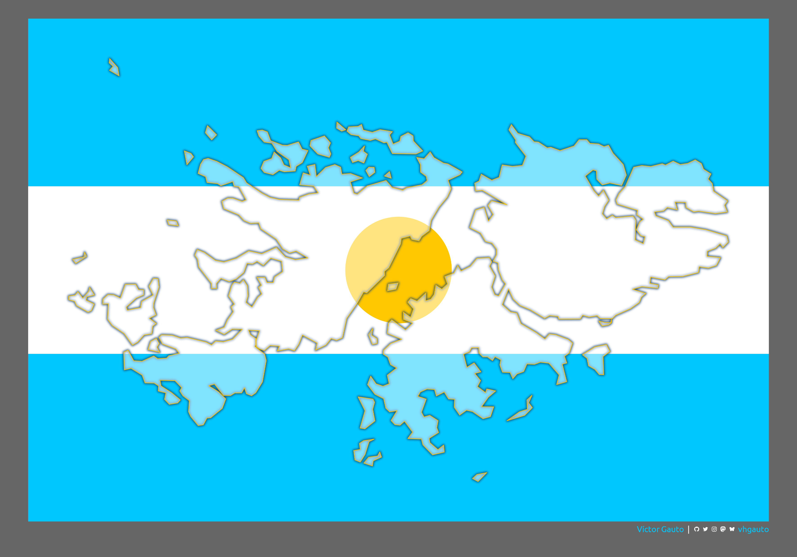

---
format:
  html:
    code-fold: show
    code-summary: "Ocultar código"
    code-line-numbers: false
    code-annotations: false
    code-link: true
    code-tools:
        source: true
        toggle: true
        caption: "Código"
    code-overflow: scroll
    page-layout: full
editor_options:
  chunk_output_type: console
categories:
  - geom_spatvector
execute:
  eval: false
  echo: true
  warning: false
title: "2 de Abril"
date: last-updated
author: Víctor Gauto
---

::: {.column-page}



En conmemoración del 2 de abril, Día del Veterano y de los Caídos en la Guerra de Malvinas.

:::

Paquetes.

```{r}
library(showtext)
library(ggtext)
library(glue)
library(terra)
library(tidyterra)
library(tidyverse)
```

Fuentes, colores y autor.

```{r}
font_add(
  family = "jet",
  regular = "./fuente/JetBrainsMonoNLNerdFontMono-Regular.ttf"
)

font_add(
  family = "ubuntu",
  regular = "./fuente/Ubuntu-Regular.ttf"
)

showtext_auto()
showtext_opts(dpi = 300)

celeste <- "#00c8ff"
sol <- "#ffc800"
blanco <- "#ffffff"
gris <- "grey40"
azul <- "#1e466e"

nombre <- glue("<span style='color:{celeste};'>**Víctor Gauto**</span>")
icon_twitter <- glue("<span style='font-family:jet;'>&#xf099;</span>")
icon_instagram <- glue("<span style='font-family:jet;'>&#xf16d;</span>")
icon_github <- glue("<span style='font-family:jet;'>&#xf09b;</span>")
icon_mastodon <- glue("<span style='font-family:jet;'>&#xf0ad1;</span>")
icon_bsky <- glue("<span style='font-family:jet;'>&#xe28e;</span>")
usuario <- glue("<span style='color:{celeste};'>**vhgauto**</span>")
sep <- glue("**|**")

autor <- glue(
  "{nombre} {sep} {icon_github} {icon_twitter} {icon_instagram} ",
  "{icon_mastodon} {icon_bsky} {usuario}"
)
```

Obtengo vector de Tierra del Fuego, Antártida e Islas del Atlántico Sur del paquete [`{geoAr}`](https://politicaargentina.github.io/geoAr/index.html). Selecciono únicamente las **Islas Malvinas**.

```{r}
tdf_v <- geoAr::get_geo(geo = "TIERRA DEL FUEGO") |>
  vect()

im_v <- tdf_v[3, ]
```

Creo un buffer alrededor de la extensión del vector de las Islas Malvinas y obtengo la distancia vertical.

```{r}
roi2 <- ext(im_v)
roi <- buffer(vect(roi2, "EPSG:4326"), 15000) |>
  ext()
y <- roi$ymax - roi$ymin
```

Creo franjas para representar la bandera Argentina a partir de dividir horizontalmente en tercios la extensión del vector.

```{r}
franjas_v <- tibble(
  xmin = roi$xmin,
  xmax = roi$xmax,
  ymin = c(roi$ymin, roi$ymin + y / 3, roi$ymin + 2 * y / 3),
  ymax = c(roi$ymin + y / 3, roi$ymin + 2 * y / 3, roi$ymax)
) |>
  pmap(\(xmin, xmax, ymin, ymax) c(xmin, xmax, ymin, ymax)) |>
  map(~ vect(ext(.x), crs = "EPSG:4326")) |>
  vect()
```

Creo el Sol a partir del centroide con un buffer.

```{r}
sol_v <- centroids(vect(roi, crs = "EPSG:4326")) |>
  buffer(width = 20000, quadsegs = 500)
```

Figura.

```{r}
g <- ggplot() +
  geom_spatvector(
    data = franjas_v,
    fill = c(celeste, blanco, celeste),
    color = NA
  ) +
  geom_spatvector(
    data = sol_v,
    fill = sol,
    color = NA
  ) +
  ggfx::with_blur(
    geom_spatvector(
      data = im_v,
      fill = NA,
      color = azul,
      alpha = .8,
      linewidth = 1
    ),
    sigma = 5
  ) +
  geom_spatvector(
    data = im_v,
    fill = blanco,
    color = sol,
    alpha = .5,
    linewidth = .3
  ) +
  coord_sf(expand = FALSE) +
  labs(caption = autor) +
  theme_void(base_family = "ubuntu") +
  theme_sub_plot(
    background = element_rect(fill = gris),
    margin = margin_auto(20),
    caption = element_markdown(margin = margin(b = 5, t = 5), color = blanco)
  )
```

Guardo.

```{r}
ggsave(
  plot = g,
  filename = "viz/im.png",
  width = 30,
  height = 21,
  units = "cm"
)
```
